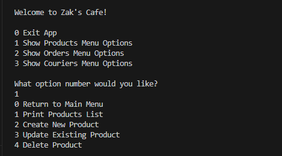

# Cafe System

This project uses Python to create a Cafe System that uses CRUD functionality to store customer data for a client. It uses a Docker container which makes use of MySQL and Adminer to store the cafe data.

## Client Requirements
- Be able to Create, Read, Update and Delete products, couriers and orders from a database.
- Track orders and order statuses to improve business efficency and customer loyalty.
- Easily modify order statuses based on the orders progress.

## Here is an example of the CLI:


#### Clone this repo
``` 
https://github.com/zmohamed1905/cafe-order-system.git
```

### How to Run:

#### CD into src directory which contains app.py file.

#### For Windows Users

```
python app.py
```

#### For Mac Users

```
python3 app.py
```
